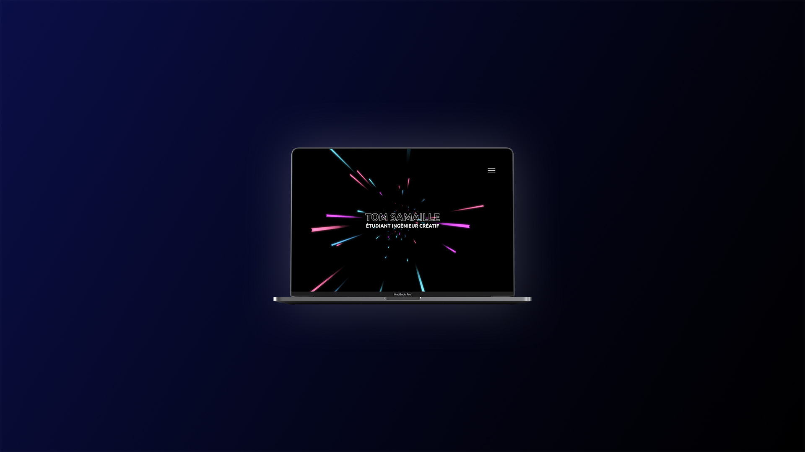

# Personnal portfolio - V1.0

Personnal portfolio regrouping some of my best projects.



## Deploy node application on linux
First download / clone the project then install dependencies with the node package manager (npm)
```
npm install
```

IMPORTANT - Don't forget to update ip & port variables from `server.js` corresponding to your needs

run `build_linux`
```
npm run build_linux
```

run the app
```
node server.js
```

## Deploy node application on windows
First download / clone the project then install dependencies with the node package manager (npm)
```
npm install
```

IMPORTANT - Don't forget to update ip & port variables from `server.js` corresponding to your needs

run the app
```
npm run start
```

*Tom SAMAILLE*

Creative engineer